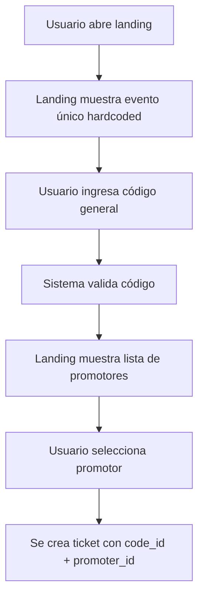
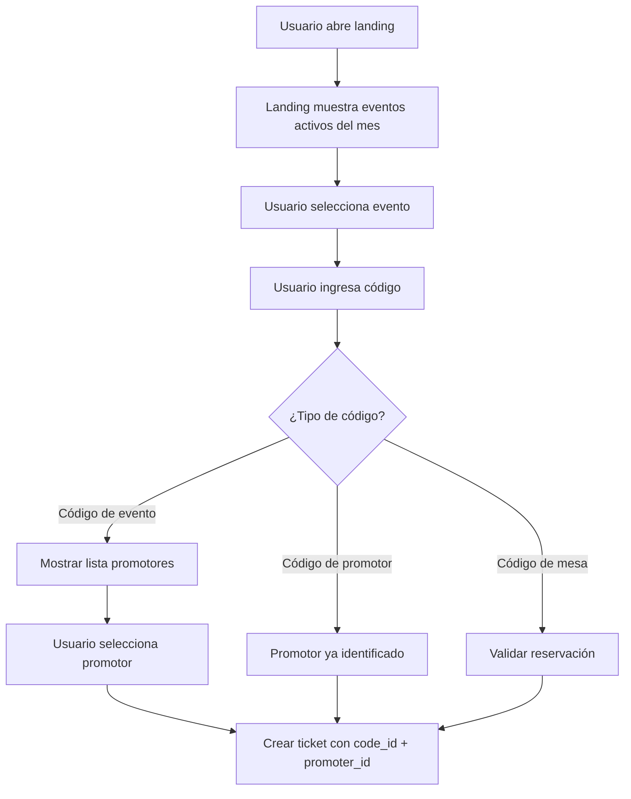

# Sistema de Códigos - Rediseño y Planificación

**Fecha:** 2026-02-08  
**Estado:** PLANNING (NO IMPLEMENTAR AÚN)  
**Stakeholders:** PM, Arquitecto, Tech Lead, Desarrolladores  
**Objetivo:** Definir arquitectura de códigos friendly, multi-evento y con flujo simplificado en landing

---

## 1. Contexto actual del sistema de códigos

### 1.1 Tipos de códigos existentes (según migraciones)

| Tipo | Propósito | Tabla relacionada | Comportamiento actual |
|------|-----------|-------------------|----------------------|
| `general` | Código del evento (uno por evento) | `codes` | Requiere seleccionar promotor en landing |
| `promoter` | Códigos de promotor | `codes` + batch | Generados en lote, asignados a promotor |
| `courtesy` | Códigos de cortesía | `codes` + batch | Similar a promoter, sin promotor asignado |
| `table` | Códigos de reservación de mesa | `codes` + batch + `table_reservations` | Vinculados a reserva de mesa |

### 1.2 Flujo actual en landing (apps/landing)

**Cuando usuario ingresa código general:**
1. Landing acepta código
2. Pide seleccionar "¿Por quién fuiste invitado?" (lista de promotores)
3. Usuario selecciona promotor
4. Se crea ticket con `code_id` del código general + `promoter_id` seleccionado

**Limitaciones detectadas:**
- Landing NO está preparada para multi-evento en el mismo mes
- Código general no identifica automáticamente al promotor
- UX confusa: si vengo por un promotor, ¿por qué tengo que seleccionarlo manualmente?
- Códigos no son "friendly" (difíciles de recordar/comunicar)

### 1.3 Restricciones actuales

**Código general:**
- Tiene hora límite de ingreso (`entry_limit` del evento)
- Capacidad máxima (`max_uses` heredada de `capacity` del evento)
- Requiere selección manual de promotor en landing

**Códigos de promotor:**
- Actualmente generados en lote con prefijos random
- NO se usan en landing pública (solo para tracking interno)

**Códigos de mesa:**
- Vinculados a reservación
- Incluyen productos (combos obligatorios)

---

## 2. Requerimientos de negocio (nuevo flujo)

### 2.1 Códigos de evento (general)
✅ **Mantener:** Código único por evento  
✅ **Mantener:** Hora límite de ingreso  
✅ **Mantener:** Capacidad máxima  
🆕 **Nuevo:** Código "friendly" (fácil de recordar y comunicar)  
🆕 **Nuevo:** Multi-evento en el mismo mes debe ser claro en landing

**Ejemplo código friendly:**
- ❌ Mal: `XG7K-9P2L-4MWQ`
- ✅ Bien: `BABY-DELUXE-FEB27` o `LOVEPARTY-0227`

### 2.2 Códigos de promotor por evento
🆕 **Nuevo:** Cada promotor tiene su propio código por evento  
🆕 **Nuevo:** Cuando usuario ingresa código de promotor, NO se le pregunta "¿por quién fuiste invitado?"  
🆕 **Nuevo:** El promotor queda automáticamente asignado al ticket  
🆕 **Nuevo:** Código "friendly" vinculado al nombre del promotor

**Ejemplo códigos de promotor:**
- ❌ Mal: `PROM-001`, `PROM-002` (genéricos, no identificables)
- ✅ Bien: `BABY-MARIA-FEB27`, `LOVEPARTY-LUIS-0227`

### 2.3 Códigos de reservación de mesa
✅ **Mantener:** Vinculados a reservación  
✅ **Mantener:** Incluyen productos/combos  
🆕 **Nuevo:** Códigos "friendly" basados en mesa y evento  
🆕 **Nuevo:** Deben coexistir con códigos general y promotor

**Ejemplo códigos de mesa:**
- ❌ Mal: `TBL-UUID-12345`
- ✅ Bien: `BABY-MESA-VIP01-FEB27`

### 2.4 Landing multi-evento
🆕 **Nuevo:** Landing debe poder mostrar eventos del mes actual  
🆕 **Nuevo:** Usuario selecciona evento ANTES de ingresar código  
🆕 **Nuevo:** Validación de código debe ser por evento seleccionado  
🆕 **Problema actual:** Landing espera UN SOLO evento activo (hardcoded)

---

## 3. Análisis de impacto arquitectónico

### 3.1 Propuesta original vs. nueva realidad

**Propuesta en BUG-2026-02-08-EVENT-CODE-ARCHITECTURE.md:**
> Agregar columna `code` a tabla `events` para simplificar

**❌ CONFLICTO:** Esta propuesta NO resuelve el nuevo requerimiento de códigos de promotor por evento.

**Razón:**
- Si `events.code` = código del evento (general)
- Y necesitamos códigos de promotor por evento
- Entonces seguimos necesitando tabla `codes` con relación `event_id + promoter_id`

### 3.2 Arquitectura recomendada (nuevos requerimientos)

#### Opción A: Normalizar tabla `events` + códigos de promotor en `codes`

```sql
-- 1. Eventos tienen su código friendly único
ALTER TABLE public.events ADD COLUMN code TEXT UNIQUE;

-- 2. Códigos de promotor quedan en tabla codes
-- type = 'promoter_event' (nuevo tipo)
-- event_id + promoter_id + code (unique)

-- 3. Códigos de mesa quedan en codes
-- type = 'table' (existente)

-- 4. DEPRECAR type = 'general'
-- El código general del evento está en events.code
```

**Ventajas:**
- Código del evento vive donde debe (en el evento)
- Códigos de promotor son entidades separadas (correcto conceptualmente)
- Elimina duplicidad de códigos generales
- Simplifica queries de backoffice

**Desventajas:**
- Migración de datos necesaria
- Cambios en API de creación/edición de eventos
- Cambios en landing (validación de código)

#### Opción B: Mantener todo en `codes` pero con tipos claros

```sql
-- 1. Renombrar tipos existentes
-- 'general' → 'event' (código del evento)
-- 'promoter' → 'promoter_batch' (lote de cortesía)
-- Nuevo: 'promoter_event' (código de promotor por evento)
-- 'table' → mantener

-- 2. Índice único por tipo
-- event: (event_id, type) WHERE type='event'
-- promoter_event: (event_id, promoter_id, type) WHERE type='promoter_event'
-- table: (event_id, table_id, type) WHERE type='table'

-- 3. Constraint: event + promoter debe generar código único
```

**Ventajas:**
- No requiere migración de estructura de tabla `events`
- Centraliza todos los códigos en un solo lugar
- Más fácil de auditar (todos los códigos en una tabla)

**Desventajas:**
- Mantiene mezcla conceptual (identificador de evento vs. códigos de acceso)
- Queries más complejas (múltiples joins)
- Riesgo de duplicidad si índices parciales fallan

---

## 4. Generación de códigos "friendly"

### 4.1 Patrón propuesto

```
{EVENT_SLUG}-{ENTITY_TYPE}-{IDENTIFIER}-{DATE_SHORT}
```

**Ejemplos:**

| Tipo | Patrón | Ejemplo |
|------|--------|---------|
| Evento | `{EVENT_SLUG}-{MMDD}` | `BABY-DELUXE-0227` |
| Promotor | `{EVENT_SLUG}-{PROMOTER_SLUG}-{MMDD}` | `BABY-MARIA-0227` |
| Mesa VIP | `{EVENT_SLUG}-VIP{NUM}-{MMDD}` | `BABY-VIP01-0227` |
| Mesa general | `{EVENT_SLUG}-MESA{NUM}-{MMDD}` | `BABY-MESA12-0227` |

**Ventajas:**
- Humano-readable
- Auto-documenta (sabes de qué evento es con solo leerlo)
- Fácil de comunicar por voz/WhatsApp
- Minimiza errores de tipeo

**Consideraciones:**
- Longitud máxima: 30 caracteres (cómodo para input móvil)
- Solo mayúsculas + números + guiones
- Sin caracteres confusos (O vs 0, I vs 1)

### 4.2 Función SQL de generación

```sql
CREATE OR REPLACE FUNCTION generate_friendly_code(
  p_event_slug TEXT,
  p_entity_type TEXT, -- 'event', 'promoter', 'table'
  p_entity_slug TEXT DEFAULT NULL,
  p_event_date DATE DEFAULT NULL
) RETURNS TEXT AS $$
DECLARE
  v_date_part TEXT;
  v_code TEXT;
BEGIN
  -- Formato fecha: MMDD
  v_date_part := TO_CHAR(COALESCE(p_event_date, CURRENT_DATE), 'MMDD');
  
  -- Construir código según tipo
  v_code := UPPER(p_event_slug) || '-';
  
  IF p_entity_slug IS NOT NULL THEN
    v_code := v_code || UPPER(p_entity_slug) || '-';
  END IF;
  
  v_code := v_code || v_date_part;
  
  RETURN v_code;
END;
$$ LANGUAGE plpgsql IMMUTABLE;
```

---

## 5. Impacto en landing pública

### 5.1 Flujo actual (single event)



### 5.2 Flujo propuesto (multi-event)



### 5.3 Cambios necesarios en apps/landing

**Archivos a modificar:**

1. **`apps/landing/app/page.tsx`** (página principal)
   - Agregar selector de evento (si hay múltiples activos)
   - Pasar `event_id` a componente de código

2. **`apps/landing/app/AccessCodeClient.tsx`** (input de código)
   - Recibir `event_id` como prop
   - Validar código contra evento específico
   - Detectar tipo de código automáticamente
   - Si es código de promotor, NO mostrar selector

3. **`apps/landing/app/registro/page.tsx`** (formulario de registro)
   - Agregar lógica de auto-asignación de promotor
   - Manejar códigos de mesa con productos

4. **API `/api/validate-code` (o equivalente)**
   - Nuevo endpoint: `POST /api/codes/validate`
   - Input: `{ event_id, code }`
   - Output: `{ valid, type, promoter_id?, requires_promoter_selection }`

---

## 6. Matriz de decisión

| Criterio | Opción A (events.code + codes) | Opción B (solo codes con tipos) |
|----------|-------------------------------|--------------------------------|
| **Simplicidad conceptual** | ✅ Alta (código evento vive en evento) | ⚠️ Media (mezcla conceptos) |
| **Facilidad implementación** | ⚠️ Media (migración necesaria) | ✅ Alta (solo renombrar tipos) |
| **Evita duplicidad** | ✅ Garantizada (unique en events.code) | ⚠️ Depende de índices parciales |
| **Queries performance** | ✅ Menos joins | ⚠️ Más joins |
| **Extensibilidad** | ✅ Clara separación | ⚠️ Todo en una tabla |
| **Auditoría** | ⚠️ Dos tablas a revisar | ✅ Todo en `codes` |
| **Riesgo** | ⚠️ Medio (cambio estructural) | ✅ Bajo (solo lógica) |

---

## 7. Plan de trabajo propuesto (sin implementar)

### Fase 1: Discovery & Alignment (2-3 días)

**Responsables:** PM + Arquitecto + Tech Lead  
**Entregables:**
- [ ] ADR con decisión de arquitectura (Opción A vs B)
- [ ] Definición de patrón de códigos friendly
- [ ] Wireframes de landing multi-evento
- [ ] Matriz de tipos de código y sus reglas

**Preguntas a resolver:**
1. ¿Cuántos eventos simultáneos habrá por mes? (capacidad de escala)
2. ¿Código de promotor es obligatorio o puede ser opcional?
3. ¿Qué pasa con códigos históricos? (migración vs. convivencia)
4. ¿Landing debe soportar eventos de múltiples organizadores?

### Fase 2: Database Design (1-2 días)

**Responsables:** Arquitecto + Tech Lead  
**Entregables:**
- [ ] Migración SQL con rollback plan
- [ ] Scripts de generación de códigos friendly
- [ ] Función de validación por tipo de código
- [ ] Índices y constraints actualizados

**Queries de validación:**
```sql
-- 1. Verificar códigos duplicados por evento
SELECT event_id, code, COUNT(*)
FROM public.codes
WHERE type IN ('event', 'promoter_event')
  AND is_active = true
GROUP BY event_id, code
HAVING COUNT(*) > 1;

-- 2. Eventos sin código friendly
SELECT id, name, code
FROM public.events
WHERE code IS NULL OR code = '';

-- 3. Promotores sin código por evento activo
SELECT e.id as event_id, e.name, p.id as promoter_id
FROM public.events e
CROSS JOIN public.promoters p
LEFT JOIN public.codes c 
  ON c.event_id = e.id 
  AND c.promoter_id = p.id 
  AND c.type = 'promoter_event'
WHERE e.is_active = true
  AND c.id IS NULL;
```

### Fase 3: Backend Implementation (3-5 días)

**Responsables:** Developers  
**Entregables:**
- [ ] API `/api/codes/validate` con detección de tipo
- [ ] API `/api/codes/generate-promoter-codes` por evento
- [ ] Actualizar `/api/events/create` para generar código friendly
- [ ] Actualizar `/api/events/update` para manejar cambio de código
- [ ] Tests unitarios de validación de códigos

**Endpoints nuevos:**

```typescript
POST /api/codes/validate
Input: { event_id: UUID, code: string }
Output: {
  valid: boolean,
  type: 'event' | 'promoter_event' | 'table' | null,
  promoter_id?: UUID,
  requires_promoter_selection: boolean,
  error?: string
}

POST /api/codes/generate-promoter-codes
Input: { event_id: UUID, promoter_ids?: UUID[] }
Output: {
  success: boolean,
  codes: Array<{ promoter_id, code, created }>
}
```

### Fase 4: Landing Redesign (3-5 días)

**Responsables:** Frontend Dev + UX  
**Entregables:**
- [ ] Selector de evento multi-mes
- [ ] Input de código con validación en tiempo real
- [ ] Auto-detección de tipo de código
- [ ] Formulario de registro adaptativo
- [ ] Tests E2E de flujo completo

**Componentes a crear/modificar:**

```tsx
// Nuevo componente
<EventSelector 
  events={activeEvents} 
  selectedEventId={eventId}
  onSelect={handleEventChange}
/>

// Modificar componente existente
<AccessCodeClient 
  eventId={selectedEventId}
  onCodeValidated={handleCodeValidated}
  autoFillPromoter={true} // si código de promotor detectado
/>
```

### Fase 5: QA & Testing (2-3 días)

**Responsables:** QA + Developers  
**Casos de prueba:**
- [ ] Usuario ingresa código de evento → selecciona promotor
- [ ] Usuario ingresa código de promotor → auto-asignación
- [ ] Usuario ingresa código de mesa → valida reservación
- [ ] Múltiples eventos activos → selector funciona
- [ ] Códigos expirados → mensaje de error correcto
- [ ] Códigos agotados (max_uses) → mensaje de error
- [ ] Códigos inválidos → mensaje friendly

### Fase 6: Migración de datos (1 día)

**Responsables:** Tech Lead + DevOps  
**Entregables:**
- [ ] Script de migración de códigos históricos
- [ ] Generación de códigos friendly para eventos existentes
- [ ] Generación de códigos de promotor por evento
- [ ] Backup pre-migración
- [ ] Validación post-migración

---

## 8. Riesgos y mitigaciones

| Riesgo | Impacto | Probabilidad | Mitigación |
|--------|---------|--------------|------------|
| Códigos duplicados post-migración | Alto | Media | Script de validación pre/post, índices únicos |
| Landing rota para eventos legacy | Alto | Baja | Feature flag para landing legacy vs. new |
| Usuarios confundidos con nuevos códigos | Medio | Alta | Comunicación clara, ejemplos en UI |
| Performance en queries de validación | Medio | Media | Índices optimizados, cache en Redis |
| Códigos friendly generan colisiones | Bajo | Baja | Validación unique + sufijo random si colisión |

---

## 9. Métricas de éxito

**Negocio:**
- ⬇️ Reducción de 50%+ en tiempo de registro (no seleccionar promotor manualmente)
- ⬆️ Incremento en tasa de conversión de código a ticket
- ⬇️ Reducción en soporte por códigos inválidos/confusos

**Técnico:**
- ✅ 0 códigos duplicados en producción
- ✅ Tiempo de validación de código < 200ms (p95)
- ✅ Cobertura de tests > 80% en módulo de códigos

**UX:**
- ⬆️ Net Promoter Score en flujo de registro
- ⬇️ Tasa de abandono en paso de código

---

## 10. Decisiones pendientes (para alinear con PM/Arquitecto)

### A resolver ANTES de implementar:

1. **Arquitectura de datos:**
   - [ ] ¿Opción A (events.code + codes) o B (solo codes)?
   - [ ] ¿Migrar códigos históricos o mantener convivencia?

2. **UX de landing:**
   - [ ] ¿Selector de evento siempre visible o auto-detectar si solo hay 1?
   - [ ] ¿Qué hacer si usuario ingresa código de evento diferente al seleccionado?

3. **Códigos de promotor:**
   - [ ] ¿Generación manual desde backoffice o automática al crear evento?
   - [ ] ¿Permitir edición de código de promotor o solo admin?
   - [ ] ¿Qué pasa si promotor se desactiva? ¿Código sigue válido?

4. **Códigos de mesa:**
   - [ ] ¿Mantener generación automática o permitir customización?
   - [ ] ¿Códigos de mesa caducan con el evento o persisten?

5. **Multi-organizador:**
   - [ ] ¿Landing debe filtrar eventos por organizador?
   - [ ] ¿Códigos pueden ser globales o siempre por organizador?

6. **Comunicación:**
   - [ ] ¿Email/WhatsApp con códigos nuevos a usuarios existentes?
   - [ ] ¿Guía de migración para promotores?

---

## 11. Próximos pasos inmediatos

### Para PM:
1. Revisar flujo propuesto de landing multi-evento
2. Validar patrón de códigos friendly con equipo de marketing
3. Definir prioridad: ¿es blocker para próximo evento?

### Para Arquitecto:
1. Decidir Opción A vs. B (argumentar en ADR)
2. Diseñar índices y constraints finales
3. Validar estrategia de migración de datos

### Para Tech Lead:
1. Estimar esfuerzo real por fase
2. Identificar dependencias técnicas bloqueantes
3. Proponer roadmap de 2-3 sprints

### Para equipo:
1. **NO CODIFICAR** hasta tener alignment en decisiones pendientes
2. Completar documento con decisiones tomadas
3. Crear tickets en backlog con criterios de aceptación claros

---

## Anexos

### A. Estructura actual tabla `codes`

```sql
CREATE TABLE public.codes (
  id UUID PRIMARY KEY,
  code TEXT NOT NULL,
  event_id UUID REFERENCES events(id),
  promoter_id UUID REFERENCES promoters(id),
  type TEXT CHECK (type IN ('general', 'courtesy', 'promoter', 'table')),
  is_active BOOLEAN DEFAULT true,
  max_uses INTEGER,
  uses INTEGER DEFAULT 0,
  expires_at TIMESTAMPTZ,
  batch_id UUID REFERENCES code_batches(id),
  created_at TIMESTAMPTZ DEFAULT NOW(),
  updated_at TIMESTAMPTZ,
  deleted_at TIMESTAMPTZ
);
```

### B. Referencias cruzadas

- Ver: `docs/BUG-2026-02-08-EVENT-CODE-ARCHITECTURE.md` (problema original detectado)
- Ver: `AGENTS.md` (marco de trabajo y roles)
- Ver: `docs/STRANGLER_PLAN.md` (estrategia de migración V1→V2)
- Ver: `supabase/migrations/2025-02-11-add-code-batches.sql` (función generate_codes_batch)

---

**IMPORTANTE:** Este documento es para PLANIFICACIÓN. No implementar código hasta tener decisiones firmadas por PM y Arquitecto.
